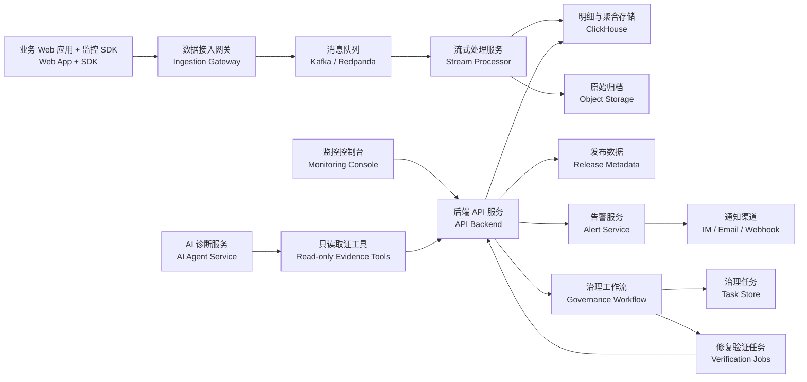
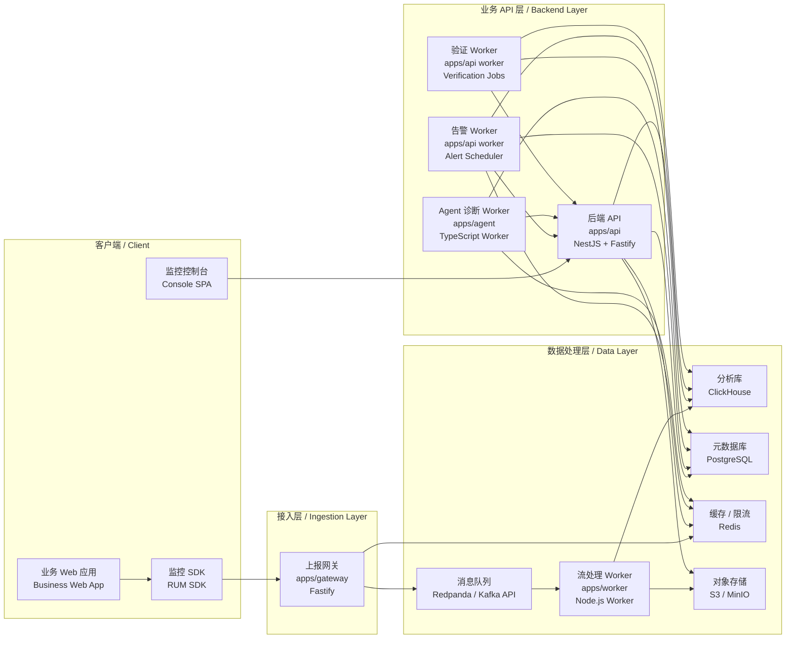
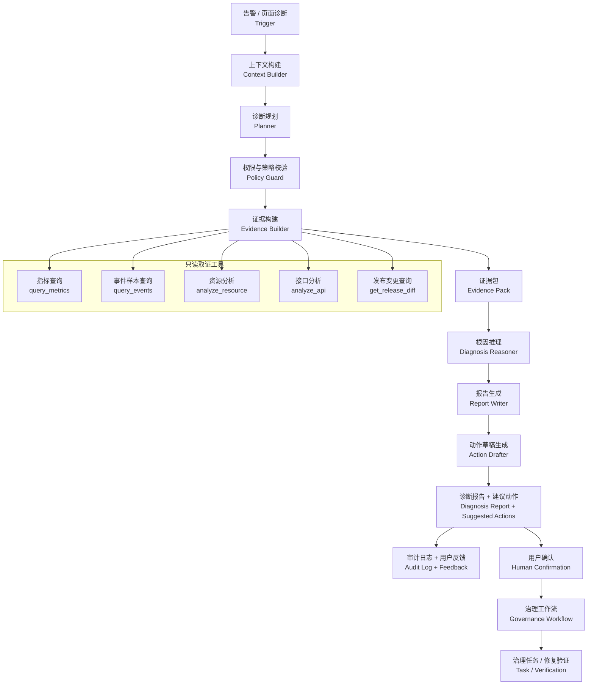

# AI Agent 前端性能监控平台：技术架构设计书

## 0. 架构结论

系统采用“数据采集与分析平台 + 受控 Agent 诊断服务 + 平台治理工作流”的架构。

```text
业务 Web 应用
  -> Web SDK
  -> 数据接入网关
  -> 消息队列
  -> 流式处理服务
  -> ClickHouse 明细与聚合存储
  -> 后端 API / 告警服务 / 控制台
  -> Agent 只读取证工具
  -> 治理任务与修复验证
```

核心设计原则：

- 写入链路、查询链路、Agent 诊断链路、治理工作流分开设计。
- Agent 不直连数据库，不执行任意 SQL，不修改生产状态。
- Agent 当前只使用 5 个只读工具：`query_metrics`、`query_events`、`analyze_resource`、`analyze_api`、`get_release_diff`。
- 创建任务、启动验证、关闭任务等动作属于平台治理工作流，不属于 Agent 取证工具。
- 发布数据必须包含 release、commit sha、构建产物 manifest、基础资源 diff 和 sourcemap 状态，否则版本归因只能降级。

## 1. 总体架构



模块职责：

| 模块 | 职责 |
| --- | --- |
| Web SDK | 采集 Web Vitals、PV、资源、API、错误、用户环境和版本上下文 |
| Ingestion Gateway | 接收上报，完成鉴权、限流、脱敏、采样、协议转换 |
| Kafka / Redpanda | 事件削峰、缓冲、回放 |
| Stream Processor | 清洗、归一化、补充 UA/地区/release/采样字段，写入存储 |
| ClickHouse | 存储明细事件和聚合指标，支撑大盘、告警和 Agent 查询 |
| API Backend | 项目权限、查询 API、页面数据、任务接口、工具接口 |
| Alert Service | 基于聚合指标触发告警、收敛告警、发送通知 |
| AI Agent Service | 基于只读工具收集证据，生成诊断报告和建议动作 |
| Governance Workflow | 承接任务创建、任务状态、修复验证和复盘 |
| Object Storage | 存储原始归档、报告附件、sourcemap 等文件 |

## 2. 服务架构

### 2.1 服务拆分原则

当前采用 TypeScript 单主栈，但服务边界仍然要清晰。这里的“统一技术栈”不是把所有代码塞进一个进程，而是用同一套语言和工程体系实现不同职责的服务。

服务拆分遵循 4 条原则：

- 写入链路独立：SDK 上报入口必须独立部署，避免被控制台 API、Agent 或后台任务影响。
- 查询链路受控：所有控制台和 Agent 查询都经过 API Backend，不允许直接暴露数据库。
- Agent 异步运行：Agent 诊断是长耗时任务，应通过任务状态驱动，不阻塞页面请求。
- 工作流可追踪：治理任务、修复验证、复盘记录必须有明确状态机和审计日志。

### 2.2 当前服务部署图



### 2.3 服务清单

| 服务 / 进程 | 形态 | 技术 | 是否独立部署 | 职责 |
| --- | --- | --- | --- | --- |
| `apps/console` | Web 前端 | React + Vite | 是 | 监控控制台、页面详情、告警详情、治理任务 |
| `packages/sdk` | SDK 包 | TypeScript + web-vitals | 否，作为 npm/script 产物发布 | 业务 Web 应用中的数据采集与上报 |
| `apps/gateway` | HTTP 服务 | Fastify | 是 | 接收 SDK 上报、鉴权、限流、脱敏、采样、写入队列 |
| `apps/worker` | 后台 Worker | Node.js | 是 | 消费队列、清洗事件、归一化、批量写 ClickHouse |
| `apps/api` | HTTP API 服务 | NestJS + Fastify Adapter | 是 | 项目、权限、查询 API、发布数据、报告、任务、工作流接口 |
| `apps/api` Alert Worker | 后台 Worker | NestJS Schedule / BullMQ Worker | 可与 API 同镜像、独立进程运行 | 周期计算告警、告警收敛、通知 |
| `apps/api` Verification Worker | 后台 Worker | NestJS Schedule / BullMQ Worker | 可与 API 同镜像、独立进程运行 | 修复观察窗口、修复前后指标对比、验证结果写入 |
| `apps/agent` | 后台 Worker / HTTP 服务 | TypeScript | 是 | Agent 诊断任务、工具调用编排、Evidence Pack、报告生成 |
| Redpanda | 基础设施 | Kafka API | 是 | 上报事件削峰、缓冲和回放 |
| ClickHouse | 基础设施 | OLAP DB | 是 | 明细事件、聚合指标和多维分析 |
| PostgreSQL | 基础设施 | RDBMS | 是 | 项目、权限、发布、告警、报告、任务和复盘 |
| Redis | 基础设施 | Cache | 是 | 采样配置、限流计数、热点缓存、任务短期状态 |
| S3 / MinIO | 基础设施 | Object Storage | 是 | sourcemap、原始归档、报告附件 |

### 2.4 进程边界

当前建议仓库统一、运行进程分离：

```text
apps/console       浏览器端 SPA
apps/api           主 API 进程
apps/api           alert-worker 进程
apps/api           verification-worker 进程
apps/gateway       上报网关进程
apps/worker        流处理进程
apps/agent         Agent 诊断进程
packages/sdk       SDK 构建产物
packages/schema    共享 Schema
```

`apps/api` 可以产出同一个镜像，通过不同启动命令运行不同进程：

```text
node dist/main.js                 API Server
node dist/workers/alert.js        Alert Worker
node dist/workers/verification.js Verification Worker
```

这样做可以复用代码和配置，同时避免告警计算、验证任务阻塞主 API 请求。

### 2.5 同步调用与异步调用

| 场景 | 调用方式 | 说明 |
| --- | --- | --- |
| 控制台查询大盘和详情 | Console -> API，同步 HTTP | API 做权限和查询成本控制 |
| SDK 上报事件 | SDK -> Gateway，同步 HTTP，Gateway -> Queue 异步 | Gateway 快速返回，避免阻塞业务页面 |
| 事件入库 | Queue -> Stream Worker -> ClickHouse，异步 | 支持削峰、重试和回放 |
| 告警计算 | Alert Worker -> ClickHouse / PostgreSQL，异步周期任务 | 告警结果写入 PostgreSQL |
| 发起 Agent 诊断 | Console/API -> Agent Task，异步 | 页面轮询或订阅任务状态 |
| Agent 取证 | Agent -> API，只读 HTTP 工具调用 | Agent 不直连数据库 |
| 创建治理任务 | Console -> API，同步 HTTP | 用户确认后写入 PostgreSQL |
| 修复验证 | Verification Worker -> API/ClickHouse，异步 | 按观察窗口写入验证结果 |

### 2.6 Agent 与 API Backend 的边界

Agent Service 不拥有业务数据访问权限。它只通过 API Backend 暴露的只读工具接口取证：

```text
Agent Service
  -> POST /internal/tools/query_metrics
  -> POST /internal/tools/query_events
  -> POST /internal/tools/analyze_resource
  -> POST /internal/tools/analyze_api
  -> POST /internal/tools/get_release_diff
```

API Backend 负责：

- 校验 Agent 任务所属项目和用户权限。
- 限制查询时间窗口、返回条数和 group_by 维度。
- 脱敏 URL、错误堆栈、Header 等敏感字段。
- 生成 `query_id` 和 `tool_call_id`。
- 写入审计日志。

Agent Service 负责：

- 诊断任务状态机。
- 工具调用计划。
- Evidence Pack 构建。
- 根因候选推理。
- 诊断报告生成。
- 建议动作和任务草稿内容生成。

### 2.7 为什么 Agent 独立，但仍然使用 TypeScript

Agent 独立是因为它的运行形态不同：长耗时、多步骤、可重试、可部分完成、需要审计和用户反馈。使用 TypeScript 是为了减少技术栈数量，复用共享 schema、工具类型和工程体系。

因此当前决策是：

- Agent 独立为 `apps/agent` 进程。
- Agent 默认使用 TypeScript。
- Agent 不直接访问 ClickHouse、PostgreSQL、Redis、S3。
- Agent 只调用 API Backend 的受控工具接口。
- 当 Agent 编排复杂度明显超过 TypeScript 方案承载能力时，再考虑替换为 Python Agent Service。

### 2.8 服务扩缩容建议

| 服务 | 扩缩容依据 |
| --- | --- |
| `apps/gateway` | 上报 QPS、请求耗时、限流比例、队列写入耗时 |
| `apps/worker` | 队列 lag、批量写入耗时、ClickHouse 写入失败率 |
| `apps/api` | API QPS、查询耗时、错误率 |
| `alert-worker` | 告警规则数量、每轮计算耗时 |
| `verification-worker` | 验证任务数量、观察窗口查询耗时 |
| `apps/agent` | 诊断任务队列长度、模型调用耗时、工具调用耗时 |
| ClickHouse | 查询 P95、写入吞吐、磁盘占用、merge 压力 |
| PostgreSQL | 连接数、事务耗时、慢查询 |
| Redis | 内存、命中率、限流 key 数量 |

## 3. 数据链路

### 3.1 写入链路

1. 浏览器 SDK 采集性能、错误、资源、接口、页面访问和版本上下文。
2. SDK 通过 `sendBeacon` 或 fetch 批量上报到接入网关。
3. 接入网关完成鉴权、限流、基础校验、脱敏、采样和协议转换。
4. 原始事件写入 Kafka/Redpanda，保证削峰和可回放。
5. 流处理服务补充地理位置、UA 解析、归一化 route/api/resource、版本信息和采样标记。
6. 明细数据写入 ClickHouse，长期归档写入对象存储。
7. 聚合任务生成分钟级和小时级指标表。

### 3.2 查询链路

- 控制台和 Agent 均通过 Backend 查询，不直连 ClickHouse。
- Backend 按项目权限、时间窗口、字段白名单、group_by 数量和查询成本做控制。
- 常用查询优先查 1m/1h 聚合表。
- 明细查询必须限制字段和返回条数，默认只返回脱敏样本。
- 每次查询生成 `query_id`，用于报告证据引用和审计。

### 3.3 告警链路

1. 告警服务周期读取 1m 聚合指标。
2. 根据阈值、环比变化、持续时间和过滤条件判断是否触发。
3. 使用项目、页面、版本、指标、设备等字段生成收敛 key。
4. 写入 `alerts` 表并发送通知。
5. 告警详情页可触发 Agent 诊断。

### 3.4 Agent 诊断链路

```text
告警 / 页面诊断
  -> 标准化诊断任务
  -> 规划查询步骤
  -> 权限与策略校验
  -> 调用只读取证工具
  -> 构建 Evidence Pack
  -> 根因推理
  -> 生成报告和建议动作
  -> 用户确认后进入治理工作流
```

### 3.5 治理链路

1. 用户从告警详情或页面详情确认创建治理任务。
2. 任务保存负责人、严重级别、证据 ID、建议动作和验收指标。
3. 研发修复并发布新版本。
4. 用户或发布事件触发修复验证。
5. 验证任务按观察窗口查询修复前后指标。
6. 平台返回 `observing`、`passed`、`failed` 或 `insufficient_data`。
7. 任务关闭时写入复盘记录。

## 4. 技术选型

详细选型依据见：[技术选型说明](./ai_frontend_monitor_tech_selection.md)。

| 模块 | 推荐选型 | 定位 |
| --- | --- | --- |
| Web SDK | TypeScript + Web Performance API + `web-vitals/attribution` | 浏览器真实用户监控采集 |
| SDK 构建 | tsup / Rollup + ESM/IIFE 双产物 | 支持 npm 接入和 script 接入 |
| 控制台前端 | React + TypeScript + Vite + Ant Design + ECharts | 内部数据工作台 |
| API Backend | NestJS + Fastify Adapter | 权限、项目配置、查询 API、工作流 API |
| 接入网关 | Node.js + Fastify | 上报、鉴权、限流、脱敏 |
| 流处理 | Node.js Worker | 事件清洗、归一化、批量写入 |
| 消息队列 | Redpanda，兼容 Kafka API | 削峰、缓冲、回放，降低运维复杂度 |
| 明细分析库 | ClickHouse | 前端监控事件明细与多维聚合分析 |
| 业务元数据 | PostgreSQL | 项目、用户、权限、发布、任务、报告元数据 |
| 缓存与限流 | Redis | 采样配置、告警状态、热点缓存、限流计数 |
| 对象存储 | S3 / MinIO | sourcemap、原始归档、报告附件 |
| Agent 服务 | TypeScript + NestJS Worker / Fastify | 受控工具调用、诊断编排、报告生成 |
| 部署 | Docker Compose 起步，Kubernetes + Helm 生产化 | 本地联调与生产部署分层 |

## 5. SDK 架构设计

### 5.1 SDK 采集模块

| 模块 | 职责 |
| --- | --- |
| Core 初始化 | 初始化 project_id、token、env、release、采样配置 |
| Web Vitals Collector | 采集 LCP、INP、CLS、FCP、TTFB |
| Page Collector | 采集 PV、路由变化、停留时间、navigation_type |
| Resource Collector | 采集资源加载耗时、体积、缓存、失败 |
| API Collector | 拦截 fetch/XHR，采集耗时、状态码、错误、超时 |
| Error Collector | 采集 JS Error、Promise Error、资源错误 |
| Context Builder | 生成 user_id_hash、session_id、设备、浏览器、网络、release |
| Transport | 批量上报、失败重试、sendBeacon/fetch 选择 |
| Privacy Hook | beforeSend、字段脱敏、事件丢弃 |

### 5.2 SDK 约束

- 初始化与采集逻辑异步执行。
- SDK 异常必须吞掉，不影响宿主页面。
- 不采集 request body、response body、完整 cookie、localStorage、sessionStorage。
- URL、API、资源路径进入上报前应支持归一化。
- trace header 注入必须可关闭。
- 上报失败时进入短期队列，超过容量后按策略丢弃。

## 6. 接入网关设计

接入网关职责：

- 校验 project token、签名、CORS 白名单和 SDK 版本。
- 执行限流、字段大小限制、事件类型白名单。
- 执行 URL query、Header、错误信息等脱敏规则。
- 根据采样配置决定保留或丢弃事件。
- 将 SDK 事件转换为统一内部事件结构。
- 写入 Kafka/Redpanda。
- 记录 accepted、rejected、sampled、dropped 等接入诊断日志。

网关返回结果需要区分：

| 状态 | 含义 |
| --- | --- |
| accepted | 事件已接收并进入队列 |
| rejected | 鉴权、字段校验或安全策略失败 |
| sampled | 命中采样策略被丢弃 |
| limited | 项目或 IP 触发限流 |

## 7. 存储与聚合设计

### 7.1 核心事件表 `rum_events`

| 字段 | 类型 | 说明 |
| --- | --- | --- |
| event_id | String | 事件 ID |
| project_id | String | 项目 ID |
| env | LowCardinality(String) | production/staging/test |
| event_type | LowCardinality(String) | perf/error/resource/api/page |
| timestamp | DateTime64 | 事件时间 |
| page_url | String | 页面 URL，需脱敏 |
| route | String | 归一化路由 |
| route_hash | String | 归一化路由 hash |
| release | String | 版本号 |
| session_id | String | 会话 ID |
| user_id_hash | String | 匿名用户 ID |
| device_type | String | desktop/mobile/tablet |
| os | String | 操作系统 |
| browser | String | 浏览器 |
| network_type | String | 网络类型 |
| country | String | 国家/地区 |
| metric_name | String | 指标名 |
| metric_value | Float64 | 指标值 |
| api_route | String | 归一化接口路径 |
| resource_type | LowCardinality(String) | script/css/img/font/fetch/other |
| resource_url | String | 资源 URL，需脱敏 |
| resource_size | UInt64 | 传输或解码体积 |
| duration | Float64 | 通用耗时字段 |
| status_code | UInt16 | HTTP 状态码 |
| error_name | String | 错误类型 |
| error_stack_hash | String | 错误堆栈 hash |
| lcp_element | String | LCP 元素摘要，需脱敏 |
| trace_id | String | 链路追踪 ID |
| sample_rate | Float32 | 当前事件采样率 |
| sdk_version | LowCardinality(String) | SDK 版本 |
| attributes | JSON | 扩展属性 |

### 7.2 聚合表

- `rum_metrics_1m`：分钟级指标，供告警和实时大盘使用。
- `rum_metrics_1h`：小时级指标，供趋势和报表使用。
- `rum_errors_grouped`：错误聚合，按 stack hash、版本、页面聚合。
- `rum_resources_grouped`：资源聚合，按资源 URL、类型、版本聚合。
- `rum_api_grouped`：接口聚合，按接口、状态码、版本聚合。

### 7.3 ClickHouse 设计注意事项

- 分区建议按天或周。
- 主排序键建议包含 `project_id`、`timestamp`、`event_type`、`route`。
- URL、API、错误堆栈等高基数字段应存 hash、归一化值和脱敏展示值。
- 常用聚合不要每次扫明细表，应通过物化视图或定时聚合表承接。
- JSON 扩展字段只放低频字段；高频过滤字段必须提升为独立列。

## 8. 发布数据设计

### 8.1 发布数据实体

- `releases`：版本号、环境、发布时间、发布人、发布状态、灰度比例、commit sha、branch。
- `release_assets`：构建产物 manifest，包括资源名、hash、类型、大小、chunk、CDN URL、是否 sourcemap 匹配。
- `release_asset_diffs`：当前 release 与基线 release 的资源体积变化、关键图片、字体、JS、CSS 变化。
- `sourcemaps`：release、资源 hash、sourcemap 文件、上传状态、解析状态、匹配状态。

### 8.2 发布写入示例

```json
{
  "project_id": "web-shop",
  "release": "v1.18.0",
  "env": "production",
  "deployed_at": "2026-07-01T10:20:00+08:00",
  "deployer": "frontend-team",
  "commit_sha": "a8f3c21",
  "branch": "main",
  "assets": [
    {
      "name": "home-banner.webp",
      "type": "image",
      "size": 1900000,
      "hash": "b91f"
    },
    {
      "name": "main.8fd3.js",
      "type": "script",
      "size": 420000,
      "chunk": "main"
    }
  ],
  "sourcemap": {
    "uploaded": true,
    "matched_assets": ["main.8fd3.js"]
  }
}
```

### 8.3 归因降级规则

- 没有 release 元数据：只能判断异常时间相关，不能判断代码版本导致。
- 没有 manifest 或资源 diff：不能输出资源体积变化导致的高置信结论。
- 没有 commit：不能建议具体代码 owner，只能建议项目或模块 owner。
- 没有 sourcemap：不能把 JS 错误稳定定位到源码行号。

## 9. Agent 架构设计

Agent 采用“单 Agent 服务 + 多能力模块 + 受控工具调用”的架构。它不是多个自治 Agent 互相调度，也不是一个可以任意查库和改配置的万能助手。



核心模块职责：

| 模块 | 职责 | 输入 | 输出 |
| --- | --- | --- | --- |
| Trigger Adapter | 统一告警触发、页面手动诊断等入口 | alert_id、page context | 标准化诊断任务 |
| Context Builder | 补齐项目、环境、时间窗口、权限、默认过滤条件 | 诊断任务、用户身份 | 诊断上下文 |
| Planner | 生成诊断计划，决定调用哪些工具 | 诊断上下文、问题类型 | 查询计划和步骤列表 |
| Policy Guard | 做权限、成本、敏感字段、时间窗口和工具白名单校验 | 查询计划 | 可执行计划或拒绝原因 |
| Evidence Builder | 调用工具并组织证据包 | 可执行计划、工具结果 | Evidence Pack |
| Diagnosis Reasoner | 基于证据生成根因候选和置信度 | Evidence Pack | 根因候选、影响面、缺失证据 |
| Report Writer | 生成结构化诊断报告 | 根因候选、证据、模板 | 报告正文 |
| Action Drafter | 生成建议动作、任务草稿内容和验收指标建议 | 报告结论、团队规则 | Suggested Actions、Task Draft、Verification Plan |
| Audit & Feedback | 记录工具调用、模型版本、用户反馈 | 全链路过程数据 | 审计日志、反馈样本 |

## 10. Agent 工具设计

### 10.1 工具设计思路

Agent 工具不是按“模型想做什么”来定，而是从真实排障问题反推：

```text
Agent 要回答的问题
  -> 需要哪些证据
  -> 证据来自哪些系统
  -> 封装成哪些受控只读工具
  -> 哪些动作交给平台治理工作流和人工确认
```

Agent 当前要回答 5 类问题：

| Agent 要回答的问题 | 需要的证据 | 工具 |
| --- | --- | --- |
| 指标是否真的异常 | LCP、INP、错误率、API P95、PV、受影响用户数、基线对比 | `query_metrics` |
| 异常样本是什么样 | 慢页面样本、错误堆栈、慢请求、LCP 元素、环境上下文 | `query_events` |
| 是否资源导致 | JS/CSS/图片/字体/三方脚本耗时、体积变化、失败率、缓存命中 | `analyze_resource` |
| 是否接口导致 | API 延迟、错误率、超时率、状态码、慢请求样本 | `analyze_api` |
| 是否发布引入 | release 时间、commit、基础资源 diff、manifest、sourcemap 状态 | `get_release_diff` |

这些工具都必须满足：

- 只读，不创建资源、不修改状态、不触发生产动作。
- 返回结构化数据，能进入 Evidence Pack。
- 接口层做权限、限流、脱敏、审计和成本控制。
- 返回 `query_id` 或 `tool_call_id`，便于报告引用和复盘。
- 证据不足时明确返回缺失项，而不是让 Agent 猜测。

### 10.2 工具目录

| 工具 | 必要入参 | 必要出参 | 约束 |
| --- | --- | --- | --- |
| `query_metrics` | project_id、time_range、metric、filters、group_by | series、summary、sample_count、query_id | 默认只能查聚合表 |
| `query_events` | project_id、time_range、event_type、filters、limit | events、total_estimate、field_masking、query_id | 默认限制返回条数和字段 |
| `analyze_resource` | project_id、time_range、route、release、filters | slow_resources、size_diff、cache_summary、lcp_candidates | 只返回脱敏 URL 和归一化资源信息 |
| `analyze_api` | project_id、time_range、route/api_route、filters | latency_summary、error_summary、slow_samples、trace_coverage | 默认按归一化 API 聚合 |
| `get_release_diff` | project_id、release、baseline_release/time_range | release_time、commit_summary、changed_assets、asset_delta、sourcemap_status | 依赖发布系统和构建产物 manifest |

### 10.3 `query_metrics`：指标查询工具

用途：查询聚合后的性能、稳定性和流量指标，是 Agent 判断“是否真的异常、异常从何时开始、影响哪个维度”的基础工具。

限制：

- 默认只能查 1m/1h 聚合表，不直接扫明细表。
- 时间窗口和 group_by 数量需要限制，避免高成本查询。
- 样本量不足时必须标记 `insufficient_sample=true`。

### 10.4 `query_events`：事件明细工具

用途：查询少量脱敏后的明细样本，用于解释聚合指标背后的具体事件，例如错误堆栈、慢请求样本、LCP 元素、资源失败样本。

限制：

- 不返回 request body、response body、cookie、localStorage、完整 header。
- 错误堆栈需要先做 sourcemap 解析和敏感信息脱敏。
- 明细样本只能用于证据解释，不能替代聚合指标判断影响面。

### 10.5 `analyze_resource`：资源分析工具

用途：分析 JS、CSS、图片、字体、三方脚本等资源对页面性能的影响，尤其服务于 LCP、FCP、Long Task 和资源失败诊断。

输出应包含：

- `slow_resources`：慢资源列表，包含 P75/P95、大小、失败率、缓存命中情况。
- `size_diff`：资源体积相对基线或上一版本的变化。
- `cache_summary`：缓存命中、协议、CDN 域名维度统计。
- `lcp_candidates`：可能影响 LCP 的关键资源。

### 10.6 `analyze_api`：接口分析工具

用途：分析接口耗时、错误率、超时率和状态码分布，用于判断性能问题是否与接口、网关或网络有关。

限制：

- API 必须先归一化，例如 `/api/product/123` -> `/api/product/:id`。
- 没有 trace_id 时只能做时间窗口弱关联。
- 不采集或返回请求/响应正文。

### 10.7 `get_release_diff`：发布变更工具

用途：查询异常窗口附近的发布事件和构建产物变化，是判断“是否由版本引入”的核心工具。

输出应包含：

- `release_time`：发布时间。
- `release_status`：发布状态，例如 success、failed、rollback、canary。
- `commit_summary`：commit sha、branch、作者、提交摘要。
- `changed_assets`：新增、删除、体积变化明显的资源。
- `asset_delta`：关键图片、字体、JS、CSS 等资源体积变化。
- `sourcemap_status`：是否存在、是否匹配。
- `coverage`：本次发布元数据完整度，例如 release_only、manifest_available、sourcemap_available。

限制：

- 没有构建产物元数据时，只能返回发布事件和版本时间线，不能生成资源体积变化的高置信结论。
- 没有 commit 信息时，不能建议具体代码 owner，只能建议项目或模块 owner。
- 没有 sourcemap 时，不能把 JS 错误稳定定位到源码行号。

## 11. Agent 运行状态与 Evidence Pack

### 11.1 诊断任务状态机

```text
Created
  -> Planning
  -> Collecting Evidence
  -> Reasoning
  -> Writing Report
  -> Drafting Actions
  -> Done
```

异常状态：

- `Need More Context`：问题缺少项目、时间范围、页面或版本等必要上下文。
- `Partial Done`：部分工具超时或不可用，但已有证据足够生成低/中置信报告。
- `Failed`：权限不足、数据不可用或核心工具失败，无法生成有效报告。
- `Cancelled`：用户取消或任务被系统超时中止。

### 11.2 Evidence Pack 结构

Evidence Pack 是 Agent 诊断的核心中间产物，用来保证报告可追溯、可复查、可复用。

```json
{
  "evidence_pack_id": "evp_20260701_001",
  "project_id": "proj_web_shop",
  "time_range": {
    "incident": ["2026-07-01T10:20:00+08:00", "2026-07-01T10:50:00+08:00"],
    "baseline": ["2026-06-24T10:20:00+08:00", "2026-06-24T10:50:00+08:00"]
  },
  "filters": {
    "route": "/home",
    "device_type": "mobile",
    "release": "v1.18.0"
  },
  "items": [
    {
      "id": "e1",
      "type": "metric_timeseries",
      "title": "LCP P75 increased after release",
      "summary": "LCP P75 rose from 2.4s to 4.1s",
      "query_id": "qry_001",
      "sample_count": 18240
    },
    {
      "id": "e2",
      "type": "resource_diff",
      "title": "Hero image size increased",
      "summary": "banner.webp grew from 180KB to 1.9MB",
      "query_id": "qry_002"
    }
  ],
  "limitations": [
    "sourcemap for main.8fd3.js is missing"
  ]
}
```

报告里的每个结论都必须能关联到 `items[].id`。

## 12. 平台治理工作流接口

以下接口属于平台治理工作流，不属于 Agent 诊断阶段的取证工具。Agent 可以生成参数建议，但必须由用户确认或由任务状态流触发。

### 12.1 `create_task_draft`：治理任务草稿接口

用途：把诊断结论转成可执行治理任务，但不自动提交，必须由用户确认。

输入：

- `title`、`description`。
- `evidence_ids`：关联 Evidence Pack 中的证据 ID。
- `acceptance_criteria`：验收指标，例如 LCP P75 目标和观察窗口。
- `suggested_owner`、`severity`、`due_date`。

输出：

- `draft_id`。
- `preview`。
- `missing_fields`：还需要用户补充的信息。

### 12.2 `start_verification`：修复验证接口

用途：在修复版本发布后，自动对比修复前后指标，判断治理任务是否达到验收标准。

输入：

- `task_id`。
- `release`：修复版本。
- `time_range`：观察窗口。
- `acceptance_criteria`：目标指标、阈值和持续时间。

输出：

- `verification_id`。
- `status`：observing、passed、failed、insufficient_data。
- `current_values`：当前指标值。
- `before_after`：修复前后对比。
- `recommendation`：是否建议关闭、继续观察或重新打开。

限制：

- 不自动关闭任务，只给验证结论。
- 样本量不足时返回 `insufficient_data`。
- 验收失败时可以建议重新触发 Agent 诊断。

## 13. 权限、安全与合规

- 项目级隔离：用户只能访问授权项目。
- 环境隔离：生产、预发、测试数据分开。
- 字段脱敏：URL query、请求体、错误信息中的手机号、邮箱、token、身份证等敏感信息默认脱敏。
- 数据保留：明细数据默认 30-90 天，聚合数据 12-24 个月。
- 审计日志：记录用户查询、Agent 工具调用、任务生成、验证启动和配置修改。
- SDK 白名单：限制上报域名和项目 token，防止恶意灌入。
- Agent 权限继承用户或告警所属项目权限，不能越权查询其他项目数据。

## 14. 采样、成本与保留策略

### 14.1 采样策略

| 事件类型 | 默认策略 | 说明 |
| --- | --- | --- |
| Web Vitals | 100% 或按页面访问采样 | 核心体验指标，优先保留 |
| JS Error / Promise Error | 100% 保留，按 stack hash 聚合限流 | 错误事件需要去重和限频 |
| API Timing | 默认 10%-30%，慢请求和错误请求 100% 保留 | 避免高频接口撑爆明细表 |
| Resource Timing | 默认采集关键资源和失败资源，大量图片可采样 | 需要配置资源类型和域名白名单 |

成本控制优先级：URL/API 归一化 > 字段白名单 > 错误去重 > 分层采样 > TTL > 冷热分层。

### 14.2 数据保留

| 数据 | 默认保留 | 说明 |
| --- | --- | --- |
| 明细事件 | 30-90 天 | 按项目等级配置 TTL |
| 1 分钟聚合 | 30 天 | 用于实时大盘和短期排障 |
| 1 小时聚合 | 12-24 个月 | 用于趋势、周报、月报 |
| 原始归档 | 90-180 天 | 存对象存储，默认不参与在线查询 |
| Agent 报告、任务和复盘记录 | 长期保留 | 用于治理追踪和历史复查 |

## 15. 非功能需求

| 类别 | 要求 |
| --- | --- |
| SDK 性能 | gzip 后建议小于 30KB，采集逻辑异步化，不能阻塞业务页面 |
| 查询性能 | 核心查询 P95 小于 3 秒，默认优先查聚合表 |
| 可用性 | 数据接入服务可水平扩展，队列削峰，写入失败可降级 |
| 准确性 | 指标定义遵循 Web Performance API 和 Web Vitals 口径 |
| 隐私 | 默认不采集明文 PII，URL、请求参数和错误堆栈支持脱敏 |
| 成本 | 支持采样、URL 归一化、TTL、聚合表和冷热分层 |
| 安全 | 项目级 token、CORS 白名单、限流、签名、RBAC、审计日志 |
| 可观测 | 接入网关、流处理、查询服务、告警服务和 Agent 工具调用均需记录指标与日志 |

## 16. 降级策略

- 队列不可用时，Gateway 可短暂缓冲或按采样降级丢弃低优先级事件。
- ClickHouse 查询过慢时，优先返回聚合表结果，并提示用户缩小时间窗口或过滤条件。
- Agent 工具超时后返回已收集证据和未完成步骤，报告标记为 `Partial Done`。
- 发布数据缺失时，Agent 只能输出低置信版本相关判断。
- sourcemap 缺失时，JS 错误只定位到 stack hash 和资源文件，不定位源码行号。

## 17. 风险与应对

| 风险 | 影响 | 应对 |
| --- | --- | --- |
| SDK 影响业务页面性能 | 用户体验受损 | 严格控制体积，异步采集，采样，性能基准测试 |
| 数据基数过高 | 查询变慢、成本升高 | URL 归一化、字段白名单、聚合表、TTL、采样 |
| Agent 结论不可靠 | 误导排查 | 所有结论必须附证据、置信度和缺失证据说明 |
| 隐私数据误采集 | 合规风险 | SDK 与接入层双重脱敏，敏感字段黑名单 |
| 告警过多 | 用户疲劳 | 告警收敛、异常分组、影响面排序和静默策略 |
| 发布系统数据缺失 | 难以判断版本引入的问题 | 接入验证页展示 release、manifest、diff、sourcemap 状态 |
| sourcemap 缺失或不可信 | JS 错误无法定位到源码 | 在接入向导中加入 sourcemap 上传和校验状态 |
| 浏览器兼容差异 | 部分指标不可采集或口径不一致 | 展示指标覆盖率，对不支持的浏览器标记 unavailable |
| Agent 查询成本过高 | 影响查询集群稳定性和模型成本 | 工具限流、查询模板、时间窗口上限、缓存 Evidence Pack |

## 18. 参考资料

- OpenTelemetry JavaScript Browser 文档：https://opentelemetry.io/docs/languages/js/getting-started/browser/
- ClickHouse Observability 文档：https://clickhouse.com/docs/use-cases/observability
- LangGraph 文档：https://langchain-ai.github.io/langgraph/
- OpenAI Agents SDK 文档：https://openai.github.io/openai-agents-python/
