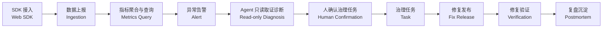
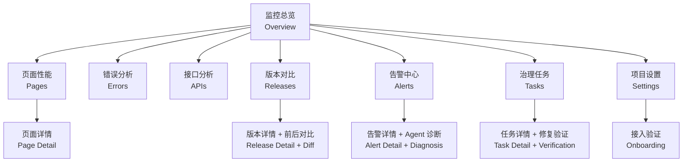

# AI Agent 前端性能监控平台：产品需求文档

## 0. 文档结论

本平台当前要建设的是一条可落地、可验证、可闭环的前端性能治理主链路：

```text
SDK 接入
  -> 数据上报
  -> 指标聚合与查询
  -> 异常告警
  -> Agent 只读取证诊断
  -> 人确认治理任务
  -> 修复发布后验证
  -> 复盘沉淀
```

第一条重点打通的业务场景是：

```text
新版本发布后，核心页面 LCP 变差
  -> SDK 采集真实用户性能数据
  -> 平台聚合页面性能指标
  -> 告警发现 LCP 劣化
  -> Agent 基于指标、事件样本、资源、接口和发布变更生成诊断报告
  -> 研发负责人确认治理任务
  -> 修复发布后平台验证 LCP 是否恢复
  -> 任务关闭并沉淀复盘
```

产品上要明确一件事：Agent 是受控诊断服务，不是自动操作生产环境的自治系统。Agent 只读取证据、生成报告和动作建议；任务创建、任务关闭、告警静默、修复验证等状态变更由平台工作流承接，并需要用户确认或明确的任务状态触发。

## 1. 项目概述

### 1.1 产品定位

建设一个面向前端团队、业务研发团队和 SRE/DevOps 团队的智能前端性能监控平台。平台采集 Web 端真实用户性能数据、错误数据、资源加载数据、接口耗时和发布变更数据，并通过 AI Agent 辅助完成异常解释、根因候选分析、影响面评估、修复建议生成和治理任务跟踪。

一句话定位：让前端性能监控从“看图查问题”升级为“发现问题、解释问题、推动修复、验证结果”的性能治理系统。

### 1.2 要解决的问题

传统前端监控平台通常能回答“哪里慢了”“哪里报错了”，但很难高效回答：

- 这次性能劣化从哪个时间点、哪个版本、哪个页面或哪个资源开始？
- 影响了多少 PV、用户和会话，主要影响哪些设备、地区和浏览器？
- 这个问题更像资源问题、接口问题、JS 错误、CDN 问题、三方脚本问题，还是发布引入的问题？
- 如果是发布引入，平台是否知道新版本增加了哪些资源、commit、构建产物和 sourcemap 状态？
- 应该先修什么，验收指标是什么，修复发布后是否真的恢复？

本项目用数据采集、指标聚合、告警、Agent 诊断和治理任务共同补齐“从异常到修复验证”的闭环。

### 1.3 产品目标

- 建立统一 Web 监控 SDK，覆盖 Core Web Vitals、页面访问、资源、接口、错误、用户环境和版本信息。
- 建立稳定的数据接入、清洗、聚合和查询能力，支撑页面、版本、设备、地区、浏览器等维度分析。
- 建立告警能力，能基于阈值和环比变化发现核心页面性能劣化。
- 建立 Agent 诊断能力，输出结构化诊断报告、证据链、根因候选、置信度和建议动作。
- 建立平台内置治理任务和修复验证能力，让性能问题可以被认领、修复、验收和复盘。

## 2. 用户与核心场景

### 2.1 目标用户

| 用户角色 | 核心诉求 | 典型使用场景 |
| --- | --- | --- |
| 前端研发 | 快速定位慢页面、慢资源、JS 错误和慢接口 | 发布后排查核心页面 LCP 劣化 |
| 前端负责人 | 评估整体性能健康度和治理优先级 | 查看核心页面趋势、告警和治理任务 |
| SRE/DevOps | 将前端体验纳入发布质量和稳定性体系 | 监控发布后性能变化和通知告警 |
| 测试/质量团队 | 验证版本发布前后的质量变化 | 对比发布前后性能、错误和接口指标 |

### 2.2 完整业务场景示例

背景：电商首页 `/home` 在 `v1.18.0` 发布后，移动端用户反馈首屏变慢。

1. 发布系统在 10:20 写入 `v1.18.0` 发布记录，包括 release、commit sha、构建产物 manifest、基础资源 diff 和 sourcemap 状态。
2. 用户访问首页时，Web SDK 自动采集 LCP、页面 PV、资源加载、接口耗时、JS Error、设备、浏览器、网络、release 和 env。
3. 接入网关完成鉴权、限流、字段校验、脱敏和批量写入。
4. 流处理服务把明细事件写入 ClickHouse，并生成 1 分钟、1 小时聚合指标。
5. 告警服务发现移动端 `/home` 的 LCP P75 从 2.4s 升到 4.1s，持续超过 10 分钟，生成告警。
6. Agent 接收告警上下文，只调用受控只读工具查询指标、事件样本、资源、接口和发布变更。
7. Agent 生成诊断报告：移动端 `/home` LCP 劣化与 `v1.18.0` 发布时间高度一致；首屏 banner 图片从 180KB 增加到 1.9MB；推荐接口 P95 同时从 420ms 升到 1.3s；JS Error 无明显变化。
8. 前端负责人查看报告证据后，确认创建治理任务，指定负责人、修复建议和验收指标：移动端 `/home` LCP P75 连续 24 小时恢复到 2.5s 内。
9. 研发压缩图片并优化接口兜底后发布 `v1.18.1`，任务进入验证状态。
10. 平台按观察窗口对比修复前后指标，返回 `passed`、`failed` 或 `insufficient_data`。
11. 指标达标后，负责人关闭任务，填写最终根因、修复方式和防复发措施，形成复盘记录。

## 3. 产品范围

### 3.1 当前功能范围

| 模块 | 能力 | 说明 |
| --- | --- | --- |
| Web SDK | Web Vitals、PV、路由、资源、API、JS Error、release/env、用户环境 | 聚焦 Web 应用接入 |
| 数据接入 | 上报鉴权、CORS、限流、脱敏、批量写入、采样配置、路由归一化 | 上报失败不得影响业务页面 |
| 存储分析 | 明细表、1m/1h 聚合表、核心查询 API | 支撑大盘、页面详情、告警和 Agent 取证 |
| 发布数据 | release、commit sha、构建产物 manifest、基础资源 diff、sourcemap 状态 | 用于判断是否由版本或资源变化引入 |
| 控制台 | 接入验证、监控总览、页面性能、错误分析、接口分析、版本对比、告警详情、治理任务与修复验证、项目设置 | 页面围绕主链路组织，覆盖§5.3 各分析能力 |
| 告警 | 固定阈值、环比突增、持续时间、过滤条件、告警收敛（含可视化聚合信息）、静默与免打扰、多渠道通知 | 告警必须能进入 Agent 诊断，且用户可看到聚合来源 |
| Agent 诊断 | 只读取证据、生成结构化诊断报告、建议动作、任务草稿、工具调用审计轨迹 | 不直接修改生产状态，所有工具调用可追溯 |
| 治理闭环 | 内置任务及状态机（Open → InProgress → Verifying → Resolved/Reopened）、负责人、验收指标、关联告警与关联修复版本、观察窗口、复盘记录 | 保证问题有人处理、有指标验收、有状态追溯 |

### 3.2 功能主链路



主链路的闭环判断标准：

- 数据能采到：业务页面接入 SDK 后，平台能看到 Web Vitals、PV、资源、API、错误和 release。
- 指标能算准：页面 LCP P75、API P95、JS Error Rate、PV、UV、受影响用户数等指标口径明确。
- 异常能发现：核心页面指标劣化时能生成告警并记录触发规则、当前值和基线值。
- Agent 能解释：诊断报告必须引用结构化证据，而不是只给主观描述。
- 问题能推进：用户能基于报告确认治理任务，任务有负责人、建议动作和验收指标。
- 修复能验证：修复版本发布后，平台按观察窗口判断指标是否恢复。
- 经验能沉淀：任务关闭时记录最终根因、修复方式和防复发措施。

### 3.3 关键约束

Agent 边界：

- Agent 不直接访问数据库裸权限，不执行任意 SQL，不抓取任意外部 URL。
- Agent 只调用平台提供的只读诊断工具，工具接口负责权限、限流、脱敏、审计和查询成本控制。
- 每一次工具调用产生一条审计记录（工具名、入参、耗时、输出摘要），可在告警详情/报告详情中回溯。
- 创建任务、关闭任务、静默告警、建议回滚、修改配置等状态变更动作由平台工作流处理，并需要用户确认或明确状态触发。

Agent 诊断可信度依赖：

- 没有 release 元数据时，Agent 只能判断“异常时间与发布相关”，不能给出“代码改动导致”的高置信结论。
- 没有构建产物 manifest 或基础资源 diff 时，Agent 不能可靠判断资源体积变化来自哪个版本。
- 没有 sourcemap 时，Agent 不能把 JS 错误或 Long Task 稳定定位到源码文件和行号。

数据与合规约束：

- 数据保留策略：明细事件默认保留 30 天；1 分钟聚合默认保留 90 天；1 小时聚合默认保留 365 天；sourcemap 默认保留至该 release 停用后 90 天；具体值可按项目配置。
- 数据出域策略：Agent 传给外部模型的上下文只包含平台内已脱敏的结构化证据字段和聚合指标，不得包含 URL 参数原文、请求/响应 body、Cookie、Header、错误堆栈中的用户信息、原始 IP、原始 user-agent。传给模型的最大证据文本长度应有明确上限。
- 审计事件：告警规则变更、任务状态流转、成员权限变更、Agent 工具调用、发布记录写入均需记录审计事件（谁、何时、做了什么、命中哪条规则）。

## 4. 监控指标体系

### 4.1 用户体验指标

| 指标 | 含义 | 用途 |
| --- | --- | --- |
| LCP | Largest Contentful Paint，最大内容绘制 | 衡量首屏主要内容加载速度 |
| INP | Interaction to Next Paint，交互到下一次绘制 | 衡量交互响应能力 |
| CLS | Cumulative Layout Shift，累计布局偏移 | 衡量视觉稳定性 |
| FCP | First Contentful Paint，首次内容绘制 | 衡量页面首次可见内容出现时间 |
| TTFB | Time To First Byte，首字节时间 | 衡量服务端、网络和 CDN 首包耗时 |
| Long Task | 主线程长任务 | 判断 JS 执行是否阻塞页面响应 |
| Resource Timing | 资源加载耗时、大小、缓存、协议 | 判断图片、JS、CSS、字体和三方脚本影响 |
| API Timing | 接口耗时、状态码、错误率 | 判断页面慢是否与接口相关 |

### 4.2 稳定性指标

| 指标 | 含义 | 用途 |
| --- | --- | --- |
| JS Error Count | JS 错误数量 | 判断脚本异常规模 |
| JS Error Rate | JS 错误会话率或访问错误率 | 衡量用户受影响比例 |
| Promise Error Count | 未处理 Promise 异常数量 | 捕获异步异常 |
| API Error Rate | 接口错误率 | 判断接口稳定性 |
| API Timeout Rate | 接口超时率 | 判断接口慢和失败 |
| Resource Error Rate | 静态资源加载失败率 | 判断 CDN、路径、权限或网络问题 |

### 4.3 流量与影响面指标

这些指标用于回答“问题影响了多少访问、多少用户、多少会话”，也是错误率、性能达标率和告警影响面计算的基础。

| 指标 | 含义 | 典型用途 |
| --- | --- | --- |
| PV | Page View，页面浏览量。用户每打开或切换到一个被监控页面，通常记为 1 次 PV | 衡量页面流量规模，作为性能统计和问题影响面的基础分母 |
| UV | Unique Visitor，独立访问用户数。通常按匿名 `user_id_hash` 去重 | 衡量真实受影响用户规模 |
| Session | 会话数。用户在一段连续访问过程中的行为集合，通常由 `session_id` 标识 | 计算错误会话率、慢会话率、受影响会话数 |
| Visit | 访问次数。一次进入站点到离开或超时结束的访问过程，可与 Session 接近 | 分析一次访问路径中的性能和错误体验 |
| Affected Users | 受影响用户数。命中过慢、错误、白屏、接口失败等条件的去重用户数 | 告警分级、影响面评估、治理优先级排序 |
| Affected Sessions | 受影响会话数。包含异常事件或性能不达标页面的去重会话数 | 比 PV 更接近用户真实体验损伤 |
| Page Load | 页面加载次数。传统多页应用通常接近 PV，SPA 中需要结合路由变化单独计算 | 区分浏览器真实加载和前端路由切换 |

PV 在 SPA 应用中不能只依赖浏览器刷新或 `load` 事件，需要监听前端路由变化。默认把“首次页面加载”和“路由切换”都计入 PV，同时在事件中标记 `navigation_type`，区分 `initial_load`、`route_change`、`back_forward`、`reload`。

统计口径补充：

- Session 超时：连续无事件 30 分钟视为会话结束；跨天访问自动切换会话；`session_id` 由 SDK 在客户端生成并持久化到会话存储。
- Visit 与 Session 的关系：默认取值一致，`visit_id = session_id`；如业务需要区分（例如同一浏览器会话跨页面跳转），可在 SDK 配置里开启独立生成。
- Affected Users 判定：默认为“同一 `user_id_hash` 命中过至少一次不达标事件”，不达标事件指：LCP > 4.0s、INP > 500ms、CLS > 0.25、TTFB > 1800ms、任意 JS/资源错误、任意 API 5xx 或超时。业务可在项目设置中自定义"命中一次或多次才算受影响"以及具体条件组合。
- Affected Sessions 判定同上，按 `session_id` 去重。

### 4.4 默认统计口径

| 指标 | 默认统计口径 | Good | Needs Improvement | Poor |
| --- | --- | --- | --- | --- |
| LCP | 页面访问维度 P75，按 route + device 聚合 | <= 2.5s | <= 4.0s | > 4.0s |
| INP | 页面访问维度 P75，按 route + device 聚合 | <= 200ms | <= 500ms | > 500ms |
| CLS | 页面访问维度 P75 | <= 0.1 | <= 0.25 | > 0.25 |
| TTFB | 页面访问维度 P75 | <= 800ms | <= 1800ms | > 1800ms |
| JS Error Rate | `error_sessions / total_sessions`，优先按会话去重 | <= 0.1% | <= 1% | > 1% |
| API P95 | 按归一化 API route + status class 聚合 | 由业务配置 | 由业务配置 | 由业务配置 |
| API Error Rate | `error_events / total_events`，按归一化 API route 聚合 | <= 0.5% | <= 2% | > 2% |
| Resource Error Rate | `failed_resource_events / total_resource_events`，按资源类型聚合 | <= 0.2% | <= 1% | > 1% |
| 页面性能达标率 | 单个 route 上 LCP/INP/CLS 三项 P75 均处于 Good 的访问占比 | >= 90% | >= 75% | < 75% |

指标展示默认使用 P75/P95，不使用平均值作为主要判断依据。页面、接口、资源 URL 必须先做归一化，否则高基数字段会直接拉高成本并降低告警质量。

设备维度差异：

- 移动端与桌面端应分别统计。移动端建议在展示层上把上述阈值放宽一档（例如 LCP Good 阈值可选 3.0s），具体阈值由项目在告警规则中显式配置，本节数值为跨设备默认基线。
- 三方 App 内 WebView（如微信内嵌浏览器）默认归入移动端，可在采样与告警配置中作为独立子分类。

## 5. 功能需求

### 5.1 数据采集 SDK

| 功能 | 说明 |
| --- | --- |
| Web Vitals 采集 | 自动采集 LCP、INP、CLS、FCP、TTFB |
| 页面生命周期采集 | PV、路由变化、页面加载、停留时间、navigation_type |
| 资源采集 | JS、CSS、图片、字体、三方脚本加载耗时、体积与失败 |
| 接口采集 | fetch/XHR 耗时、状态码、错误、超时、trace header |
| 错误采集 | window.onerror、unhandledrejection、资源错误 |
| 用户上下文 | 匿名 user_id、session_id、设备、网络、地区、浏览器 |
| 版本上下文 | project_id、env、release、sdk_version |
| 采样控制 | 按项目、环境、页面、事件类型动态采样 |

SDK 设计要求：

- 不阻塞首屏渲染，初始化和采集逻辑异步执行。
- 默认不采集 request body、response body、完整 cookie、localStorage、sessionStorage。
- 支持 `beforeSend(event)` 钩子，允许业务侧做二次脱敏、丢弃或补充字段。
- 支持路由归一化配置，例如 `/product/123` 归一化为 `/product/:id`。
- 对 fetch/XHR 自动注入或透传 trace header 时必须可关闭，避免影响跨域和第三方接口。
- SDK 自身异常必须吞掉并上报内部诊断事件，不得影响宿主页面。

### 5.2 数据接入与处理

- 接入网关提供 HTTP/Beacon 上报接口。
- 网关完成项目 token 鉴权、CORS 校验、限流、字段校验、脱敏、采样和协议转换。
- 原始事件写入消息队列，流处理服务补充 UA、地理位置、route/api/resource 归一化、采样标记和 release 关联。
- 明细数据写入分析存储，常用指标通过物化视图或定时任务生成 1m/1h 聚合表。
- 查询服务只暴露受控查询 API，不向控制台或 Agent 暴露裸 SQL。

### 5.3 监控与分析

分析能力按控制台一级视图归口。每一项在§6 中都有对应的原型页面：

| 能力 | 对应视图 | 说明 |
| --- | --- | --- |
| 监控总览 | Overview | 核心指标趋势、告警状态、核心页面健康度、错误趋势、TOP 问题、Agent 摘要 |
| 页面分析 | Pages / Page Detail | 按 route 聚合 LCP/INP/CLS/FCP/TTFB 的 P75，支持版本、地区、设备、浏览器过滤；页面详情内含**资源瀑布**和**关联接口**子模块 |
| 错误分析 | Errors | 按错误分组聚合，展示 JS/Promise/资源错误的次数、受影响用户、错误堆栈、首末次出现时间；支持按 release 过滤 |
| 接口分析 | APIs | 接口耗时、错误率、超时率、慢请求分布、trace_id 覆盖率 |
| 版本对比 | Releases / Version Diff | 展示发布前后性能、错误、接口和资源变化；资源侧含新增、删除、体积变化的资源清单 |
| 用户影响面 | 告警详情、任务详情内子模块 | 展示受影响用户数、受影响会话数、PV、设备与地区分布；不独立成页，跟随具体问题上下文出现 |

术语说明：

- 「资源分析」在本 PRD 中不作为独立一级视图；资源分析能力分布在**页面详情的资源瀑布**和**版本对比的资源 diff** 两处，因为资源问题永远伴随具体页面或具体版本，独立成页会离开用户排查心智。
- 「用户影响面」同理，跟随告警和任务出现；如需跨告警合并影响面，通过任务列表的影响用户排序即可覆盖。

### 5.4 发布与代码变更数据接入

如果要让 Agent 判断“是否由新版本代码引入”，平台不能只记录版本号和发布时间，还必须接入发布元数据、构建产物和源码映射信息。

| 数据 | 说明 | 用途 |
| --- | --- | --- |
| release 记录 | 版本号、环境、发布时间、发布人、发布状态、灰度比例 | 判断异常是否从某次发布后开始 |
| commit 信息 | commit sha、branch、作者、提交摘要 | 关联具体代码版本 |
| 构建产物 manifest | JS/CSS/图片/字体等资源文件名、hash、大小、类型、所属 chunk | 分析资源体积变化和新增资源 |
| 基础资源 diff | 基于构建产物 manifest 计算资源新增、删除和大小变化 | 判断图片、JS、CSS、字体等资源变化是否导致性能劣化 |
| sourcemap | JS sourcemap 与 release、资源 hash 的匹配关系 | 将 JS 错误定位到源码 |

接入验证页需要显式展示以下五项发布数据的状态，让团队知道 Agent 的诊断可信度来自哪些数据基础：

1. release 记录（含版本号、环境、发布时间、发布人、灰度比例）
2. commit 关联（commit sha + branch）
3. 构建产物 manifest（资源数量、总体积）
4. 基础资源 diff（相对上一 release 的新增/删除/体积变化）
5. sourcemap 匹配率（已上传且能匹配到当前 release JS 资源的比例）

每一项独立展示 Passed / Warning / Failed / Waiting 状态，任一项缺失都会在告警详情和诊断报告中显式提示"缺失证据"。

### 5.5 告警与协作

告警规则字段（用户在告警规则编辑界面须能配置）：

| 字段 | 说明 |
| --- | --- |
| 规则名 | 人类可读 |
| 指标 | LCP P75、INP P75、CLS P75、API P95、API Error Rate、JS Error Rate、Resource Error Rate、页面达标率 等 |
| 触发方式 | 固定阈值 / 环比变化 / 同比变化，三选一 |
| 阈值 | 固定阈值填绝对值；环比/同比填变化幅度百分比 |
| 持续时间 | 满足条件持续多久后才触发，默认 10 分钟 |
| 过滤条件 | route / 版本 / 设备 / 地区 / 浏览器 / 环境 的任意组合 |
| 严重级别 | S0 / S1 / S2 / S3 |
| 通知渠道 | 从项目已配置的渠道中多选，至少一项 |
| 通知升级 | 未认领 N 分钟后升级到指定组或值班人，可选 |
| 生效时间窗 | 是否全天生效，是否排除非工作时间，是否在发布窗口内自动静默 |
| 启用状态 | 开 / 关 |

告警收敛与静默：

- 告警收敛按 (项目, route, 版本, 指标, 根因候选) 五元组聚合子告警，聚合后仍保留每条子告警的时间线，用户在告警详情能看到"本告警聚合了 N 条子告警，来源 X 条子规则"。
- 静默：用户可对单条告警执行"静默 1 小时 / 4 小时 / 24 小时 / 至下次修复发布"；静默期间不再触发通知，但指标持续采集。
- 免打扰：项目级配置，可指定发布窗口、值班交接窗口等时段内某些级别自动静默。

告警详情必备信息：

- 告警摘要（状态、严重级别、触发时间、持续时长、影响面）
- 触发规则、当前值、基线值、变化幅度
- 收敛信息（聚合的子告警数量、来源规则）
- 时间线（发布、异常开始、告警触发、Agent 诊断、人工处理记录）
- Agent 诊断报告（结论、影响面、证据、根因候选、建议动作、缺失证据、置信度、工具调用轨迹）
- 协作动作（认领、静默、标记误报、添加评论、生成治理任务、进入修复验证）

告警分级建议：

| 级别 | 触发条件示例 | 默认处置 |
| --- | --- | --- |
| S0 | 白屏率 > 5%、核心交易链路 API 错误率 > 10% 且影响用户 > 1k/分钟 | 立即通知值班人和负责人，5 分钟未认领升级到 leader，生成诊断报告 |
| S1 | 核心页面 LCP/INP/API P95 显著劣化并持续超过 10 分钟 | 通知项目群，建议创建治理任务 |
| S2 | 非核心页面或小流量分群出现性能劣化 | 收敛到治理看板 |
| S3 | 趋势性问题、性能预算轻微超标 | 进入任务池观察 |

"大量用户"等定性词的具体阈值由项目在规则中显式配置，不使用文档中的举例作为落地阈值。

### 5.6 治理任务与修复验证

任务是主链路 8 阶段中的关键闭环载体，独立立项、独立追踪。

任务字段：

| 字段 | 说明 |
| --- | --- |
| id | 任务唯一编号 |
| 标题 | 人类可读 |
| 来源告警 | `alert_id`（一对一），任务详情必须能反向跳回告警详情 |
| 关联证据 ID | Agent 报告中的证据编号数组（e1、e2…），点击可回溯到原始查询 |
| 负责人 | 项目成员 |
| 优先级 | P0 / P1 / P2 / P3 |
| 状态 | 见下方状态机 |
| 验收指标 | 指标 + 阈值 + 观察窗口三元组，例如"移动端 /home LCP P75 连续 24h ≤ 2.5s" |
| 关联修复版本 | `release`，任务进入 Verifying 后必填 |
| 处理动作 / commit | 修复过程中关联的 commit sha 列表 |
| 截止时间 | 可选 |
| 复盘 | 最终根因、修复方式、防复发措施三段式，任务 Resolved 后必填 |

任务状态机：

```text
       ┌──────────┐
       │   Open   │  已生成任务，等待认领
       └────┬─────┘
            │ 指派负责人
            ▼
       ┌──────────┐
       │InProgress│  修复中，可关联 commit
       └────┬─────┘
            │ 提交修复版本
            ▼
       ┌──────────┐
       │Verifying │  进入观察窗口
       └────┬─────┘
     达标 │       │ 不达标或指标再次劣化
          ▼       ▼
   ┌──────────┐ ┌──────────┐
   │ Resolved │ │ Reopened │────► 回到 InProgress 或重新触发 Agent
   └──────────┘ └──────────┘
```

修复验证：

- 验证由平台 Verification Worker 在任务进入 Verifying 状态后启动。
- 观察窗口默认取任务验收指标里定义的窗口（如 24 小时），可延长但不可缩短。
- 平台每小时采样对比修复前后指标，输出四种验证状态：`observing`（观察中）、`passed`（达标）、`failed`（未达标）、`insufficient_data`（样本不足）。
- `failed` 或 `insufficient_data` 自动写入任务活动流，允许人工延长窗口或标记 Reopened。

任务创建体验：

- 用户在告警详情点击"创建治理任务"，平台弹出预填表单：标题从 Agent 报告结论生成，验收指标从建议动作里抽取，影响用户/会话自动带入，证据 ID 数组自动关联。用户可修改任一字段后提交。
- 任务提交后，告警详情底部显示"已生成任务 task-XXXX"，可点击进入。

## 6. 产品原型设计

### 6.1 信息架构



一级导航说明：

- Overview、Pages、Errors、APIs、Releases、Alerts、Tasks、Settings 八项作为一级导航项。
- 接入验证（Onboarding）在 Settings 之下，但当项目健康状态显示"接入不完整"时，Overview 也提供直接跳转入口，避免新项目找不到入口。

### 6.2 全局布局

- 左侧导航：总览、页面性能、错误分析、接口分析、告警中心、治理任务、项目设置。
- 顶部工具条：项目、环境、时间范围、版本、设备、地区、刷新。
- 主内容区：指标卡、趋势图、分布图、明细表和任务流。
- 右侧诊断侧栏：在页面详情和告警详情中展示 Agent 诊断、证据和建议动作。

### 6.3 监控总览

目标：让用户在 30 秒内判断当前项目是否健康，以及最需要处理的问题是什么。

核心模块：

- 健康状态条：整体状态、当前告警数、受影响用户数、最近一次发布。
- 核心指标卡：LCP P75、INP P75、CLS P75、JS Error Rate、API P95、资源失败率。
- 趋势区：按时间展示核心指标趋势，可切换指标。
- TOP 问题区：慢页面、错误、慢接口、慢资源。
- Agent 摘要：自动总结当前最值得关注的问题，点击可进入详情。

```text
+--------------------------------------------------------------------------------+
| Health Warning | Active Alerts 5 | Affected Users 12.4k | Release v1.18.0      |
+--------------------------------------------------------------------------------+
| LCP P75 3.8s ↑ | INP P75 280ms ↑ | CLS 0.08 | JS Error 1.2% ↑ | API P95 920ms |
+--------------------------------------------------------------------------------+
| Core Metrics Trend                                                            |
| [ line chart: LCP / INP / API P95 / Error Rate ]                              |
+----------------------------------------+---------------------------------------+
| Top Problem Pages                      | Agent Summary                         |
| 1. /home        LCP 4.1s               | Mobile /home LCP worsened after       |
| 2. /product/:id INP 390ms              | v1.18.0. Main evidence: image size    |
| 3. /checkout    Error 2.3%             | and recommendation API latency.       |
+----------------------------------------+---------------------------------------+
```

### 6.4 页面性能详情

目标：帮助前端研发定位某个页面为什么慢。

核心模块：

- 页面概览：路由、PV、受影响用户、版本分布、性能达标率。
- Web Vitals 趋势：LCP、INP、CLS、FCP、TTFB。
- 用户分布：设备、浏览器、网络、地区。
- 资源瀑布：首屏关键资源、耗时、体积、缓存命中。
- 关联接口：页面内接口 P75/P95、错误率。
- Agent 诊断侧栏：根因候选、证据、建议动作。

### 6.5 告警详情与 Agent 诊断报告

目标：把告警从“指标异常”变成“可行动的问题说明”。

核心模块：

- 告警摘要：状态、严重级别、触发时间、持续时长、影响面。
- 指标证据：触发规则、当前值、基线值、变化幅度。
- 收敛信息：本告警聚合了多少条子告警、来源哪些子规则；可展开查看每条子告警的时间线。
- 时间线：发布、异常开始、告警触发、Agent 诊断开始/完成、人工处理记录。
- Agent 诊断报告：结论、影响面、证据、根因候选、建议动作、缺失证据、置信度。
- Agent 工具调用轨迹（可折叠）：本次诊断调用了哪些只读工具（`query_metrics` / `query_events` / `analyze_resource` / `analyze_api` / `get_release_diff` 等）、每次调用的入参摘要、耗时、命中样本数、输出摘要。用于合规审计和证据可追溯。
- 协作区：认领、静默、标记误报、添加评论、创建治理任务（点击弹出预填表单）、进入验证。
- 关联任务：若本告警已生成治理任务，展示任务号和状态，可跳转到任务详情。

### 6.6 设置与接入验证

目标：降低项目接入成本，确保采集口径和安全策略一致。

Settings 页面通过 Tab 组织，每个 Tab 都是可读+可写：

| Tab | 内容 |
| --- | --- |
| 接入验证 | SDK 接入向导 + 9 步验证列表（见下）；单独也可作为一级导航"接入验证"直达 |
| 采样配置 | 按事件类型、页面、环境、项目设置采样率；含实时上报统计（QPS、丢弃率、限流命中数） |
| 路由归一化 | 用户可配置正则或规则表达式，例如 `/product/123` → `/product/:id`；页面详情按归一化后的 route 聚合 |
| 脱敏规则 | URL 参数、Header、错误堆栈脱敏；每类规则可开关、可预览命中 |
| 告警规则 | 列表 + "新建/编辑"抽屉，抽屉字段严格对应§5.5 告警规则字段表；可复制、可禁用 |
| 发布数据 | release 列表、manifest 上传入口、资源 diff 查看入口、sourcemap 匹配率 |
| 通知渠道 | 项目支持的渠道（飞书 / 企业微信 / 邮件 / Webhook）配置和测试 |
| 成员与角色 | 项目成员列表、RBAC 角色管理、project token 轮换与废弃 |

接入验证 9 步（前 5 项是 SDK 上报侧，后 4 项是发布数据侧）：

```text
+--------------------------------------------------------------------------------+
| SDK Setup / Verification                                                       |
+--------------------------------------------------------------------------------+
| Step 1 Token        Passed     Events signed with project token                |
| Step 2 Domain       Passed     https://www.example.com in CORS allowlist       |
| Step 3 Web Vitals   Receiving  LCP 2.4s / INP 168ms / CLS 0.04                 |
| Step 4 Errors       Waiting    No JS error event received in last 30 min       |
| Step 5 API Timing   Receiving  128 requests in last 10 min                     |
| Step 6 Release      Passed     v1.18.0 received                                |
| Step 7 Manifest     Passed     38 assets received                              |
| Step 8 Resource Diff Passed    3 added, 1 removed, 2 size changes              |
| Step 9 Sourcemap    Warning    main.8fd3.js sourcemap missing                  |
+--------------------------------------------------------------------------------+
```

### 6.7 治理任务与修复验证

目标：把 Agent 建议变成可跟踪、可验收、可复盘的治理任务。

核心模块：

- 任务列表：来源告警（可点击回跳）、问题类型、负责人、优先级、状态、验收指标、截止时间；支持按状态和负责人过滤。
- 任务详情：问题摘要、影响面、证据链（可点击 evidence ID 回溯查询）、Agent 报告引用（不重复展示，仅结论 + 根因候选 + 跳回按钮）、关联告警、关联修复版本。
- 验收指标：修复目标、观察窗口、当前值、目标值、是否达标；观察窗口的对比图按当前任务的验收指标参数化。
- 修复记录：处理动作、相关 commit、发布时间、回滚记录。
- 复盘沉淀：根因确认、最终修复方式、防复发措施。
- 创建任务体验：告警详情"创建治理任务"按钮弹出预填表单（字段来自 Agent 报告），用户可微调后提交；提交后回到告警详情并显示已生成任务。

任务状态：

| 状态 | 含义 | 可执行动作 |
| --- | --- | --- |
| Open | 已生成任务，等待确认和认领 | 指派负责人、调整优先级、关闭为误报 |
| In Progress | 已确认问题，正在修复 | 关联 commit、补充处理记录 |
| Verifying | 修复已发布，进入观察窗口 | 查看修复前后对比、延长观察窗口 |
| Resolved | 验收指标达标，问题关闭 | 填写复盘 |
| Reopened | 指标再次劣化或修复无效 | 重新触发 Agent 诊断 |

### 6.8 版本对比视图

目标：让 Agent"是否由发布引入"的结论有可视对照，让研发能直接看到发布前后的差异。

信息架构：一级导航 Releases → 版本列表 → 版本详情（含前后对比）。

版本列表：

- 每行：release 号、环境、发布时间、发布人、灰度比例、commit sha、状态（发布中 / 已发布 / 已回滚）、当前活跃告警数、性能变化摘要（LCP/INP/API 中位偏移）。
- 支持按环境、时间、状态筛选。

版本详情（对比视图）：

- 顶部选择器：本 release 对比目标（默认上一 release），可换成任意历史版本。
- 指标对比：LCP / INP / CLS / API P95 / JS Error Rate / 页面达标率 六项，展示"发布前 24h 基线"与"发布后至今"的 P75 差异，标红显著劣化项。
- 页面差异：按 route 排序，展示各页面上述指标的变化幅度；点击进入页面详情。
- 资源 diff：新增资源、删除资源、体积变化的资源清单，各行标注体积、hash、chunk 归属。
- 错误 diff：新出现的错误分组、消失的错误分组、次数明显变化的错误分组。
- 接口 diff：新增接口、耗时明显变化的接口。
- 关联告警：在两次发布之间触发的所有告警清单，可跳转告警详情。

版本详情的下钻链路：从任一 diff 行点击可直接进入 Pages / Errors / APIs 的详情，且时间范围自动锁定到该 release 的观察窗口。

## 7. AI 诊断报告模板

Agent 输出固定结构，方便人读也方便系统落库。所有字段作为契约存入 PostgreSQL，UI 从结构化数据渲染，不做自由文本解析。

置信度枚举固定为三档：`high`（证据充分且互相印证）、`medium`（证据存在但存在替代解释）、`low`（相关性弱或样本不足）。

```markdown
## 结论
移动端首页 LCP 在 2026-07-01 10:20 后显著升高，P75 从 2.4s 上升到 4.1s，主要影响 v1.18.0 版本。

## 影响面
- 影响页面：首页 `/home`
- 影响用户：约 12.4k 用户
- 影响会话：约 18.7% 移动端会话
- 影响版本：v1.18.0

## 证据
- e1：LCP P75 在发布后 30 分钟内上升 70.8%
- e2：首屏 banner 图片大小从 180KB 增至 1.9MB
- e3：`/api/recommend` 接口 P95 从 420ms 上升到 1.3s
- e4：相同时间窗口 JS Error 无明显变化

## 根因候选
1. 首屏图片资源体积增大导致 LCP 劣化，置信度 high。
2. 推荐接口变慢进一步拖慢首屏渲染，置信度 medium。

## 建议动作
1. 压缩首屏 banner 图片，目标小于 300KB。
2. 对推荐接口增加超时降级和骨架屏策略。
3. 发布修复后观察移动端首页 LCP P75 是否回到 2.5s 内。

## 缺失证据
- main.8fd3.js sourcemap 缺失，无法完成 JS 源码级定位。

## 工具调用轨迹（审计用，UI 可折叠）
- t1：query_metrics(route=/home, metric=lcp_p75, window=24h) → 24 个数据点，耗时 82ms
- t2：get_release_diff(from=v1.17.4, to=v1.18.0) → 3 项资源变化，耗时 45ms
- t3：analyze_resource(route=/home, top_n=5) → banner.png 体积 +10.5x，耗时 61ms
- t4：analyze_api(route=/home) → /api/recommend P95 +210%，耗时 73ms
- t5：query_events(route=/home, event=js_error, window=24h) → 未见显著变化，耗时 39ms
```

字段约束：

- `evidence[]` 必须至少 2 条，且每条 evidence 都必须能追溯到具体查询条件与样本；报告中的 evidence ID 在告警详情、任务详情中都可以点击回溯。
- `candidates[]` 至多 5 条；每条必须绑定 evidence ID 引用；无 evidence 支持的根因不得进入 candidates。
- `missing[]` 缺失证据必须显式列出；一份没有 sourcemap、没有 release manifest、没有 diff 数据支持的报告，`missing` 至少要提示这一点。

## 8. 验收标准

| 模块 | 验收标准 |
| --- | --- |
| SDK 接入 | 业务安装 SDK、初始化项目 token、传入 release/env 后，可采集 Web Vitals、PV、错误、资源和接口事件 |
| 数据上报 | 支持批量上报、失败重试（指数退避，至多 3 次）、基础压缩、采样配置拉取；上报失败不影响业务页面；单次批量上报体积上限 32KB |
| 查询分析 | 支持按项目、环境、时间、页面、版本、设备、浏览器过滤；控制台核心查询（Overview 六项指标、页面详情、告警详情、任务详情）在最近 24 小时数据下 P95 ≤ 3 秒 |
| 发布数据 | 每次发布能写入 release、commit sha、manifest、基础资源 diff 和 sourcemap 状态；接入验证页 9 步全部可见 |
| 告警时延 | 满足告警规则条件到告警事件生成的中位数 ≤ 2 分钟，P95 ≤ 5 分钟 |
| 告警 | 支持固定阈值、环比突增和同比突增；能生成告警事件并通知到团队渠道；支持收敛、静默、免打扰 |
| Agent 诊断 | 对告警生成结构化诊断报告，包含结论、影响面、证据、根因候选、建议动作、缺失证据、置信度和工具调用轨迹；告警触发到报告生成的中位数 ≤ 3 分钟，P95 ≤ 5 分钟 |
| 治理任务 | 用户能基于报告创建治理任务，任务包含负责人、验收指标、关联告警、关联修复版本和证据 ID；任务状态机完整支持 Open/InProgress/Verifying/Resolved/Reopened |
| 修复验证 | 修复版本发布后，平台按任务定义的观察窗口每小时输出 `observing`、`passed`、`failed` 或 `insufficient_data` |
| 权限合规 | 项目级 RBAC、生效 token 鉴权、URL/query/error stack 脱敏、审计日志可查询；数据保留策略生效并可按项目配置 |

## 9. 待明确问题

以下问题需要业务方或架构评审给出明确决策，才能进入设计与实现。已按影响面从高到低排列。

| 优先级 | 问题 | 影响 | 建议决策方向 |
| --- | --- | --- | --- |
| P0 | RBAC 角色矩阵 | §5.5 / §6.6 / §8 都提到"项目级 RBAC"但未定义角色。缺角色矩阵，成员管理、审计事件、告警操作权限都无法落地 | 建议：Owner / Maintainer / Developer / Viewer 四档；Owner 可管理成员和 token，Maintainer 可编辑告警规则和创建任务，Developer 可认领任务和评论，Viewer 只读 |
| P0 | project token 密钥管理 | 影响接入安全和轮换；PRD 目前只说"生效 token 鉴权" | 明确 token 轮换/废弃流程、是否支持多 token、每个 token 是否可绑定环境/域名白名单 |
| P0 | AI 使用的模型和数据出域策略 | 决定合规、成本和延迟；§3.3 已增数据出域原则，但具体模型、部署位置、上下文体积上限未定 | 架构评审前确定：模型（GPT-4 / Claude / 自建）、部署位置（公有云 / 私有部署）、单次上下文体积上限、审计留存期 |
| P1 | 多租户 / 多组织模型 | 同一部署里能容纳多少个团队？团队之间数据是否隔离？项目级 RBAC 是否也承担组织级隔离 | 建议：单一组织下多项目，项目之间强隔离（存储、告警、成员）；跨组织通过独立部署实现 |
| P1 | 数据保留期具体值 | §3.3 已给默认值（明细 30 天 / 1m 90 天 / 1h 365 天），需要业务方确认是否满足合规和成本 | 首个试点项目跑通后再调整 |
| P1 | 数据量级预估：PV、API 请求量、错误量 | 决定存储分区、采样、机器规格 | 启动前补充容量预估表 |
| P1 | 移动端 vs 桌面端阈值差异 | §4.4 说"默认基线为跨设备"，实际业务往往需要分开配置 | 首个试点项目按业务实际值配置，作为默认值参考沉淀 |
| P2 | 首个试点项目选择哪个 | 决定接入成本、数据质量和验收样例 | 优先选择有发布记录、流量稳定、核心页面明确的 Web 项目 |
| P2 | 现有发布系统能提供哪些字段 | 决定 Agent 版本归因可信度 | 至少提供 release、commit sha、manifest、基础资源 diff、sourcemap 状态 |
| P2 | 是否允许上传 sourcemap | 决定 JS 错误源码定位能力 | 建议作为项目接入校验项，支持权限控制；未上传可作为 Warning 而非 Failed |
| P3 | 通知渠道具体形态 | §5.5 只说"至少一种"；影响用户体验 | 建议至少支持飞书群 + 邮件；Webhook 作为扩展 |
| P3 | 数据导出能力 | 用户是否需要把诊断报告导出为 PDF / 邮件？是否需要 CSV 导出明细 | 首个版本可先不做，等用户反馈 |
| P3 | Hybrid App / 小程序场景 | PRD 明确"Web SDK"，是否覆盖 WebView 和小程序 | 首个版本仅覆盖 Web；WebView 归入移动端；小程序不在范围 |
