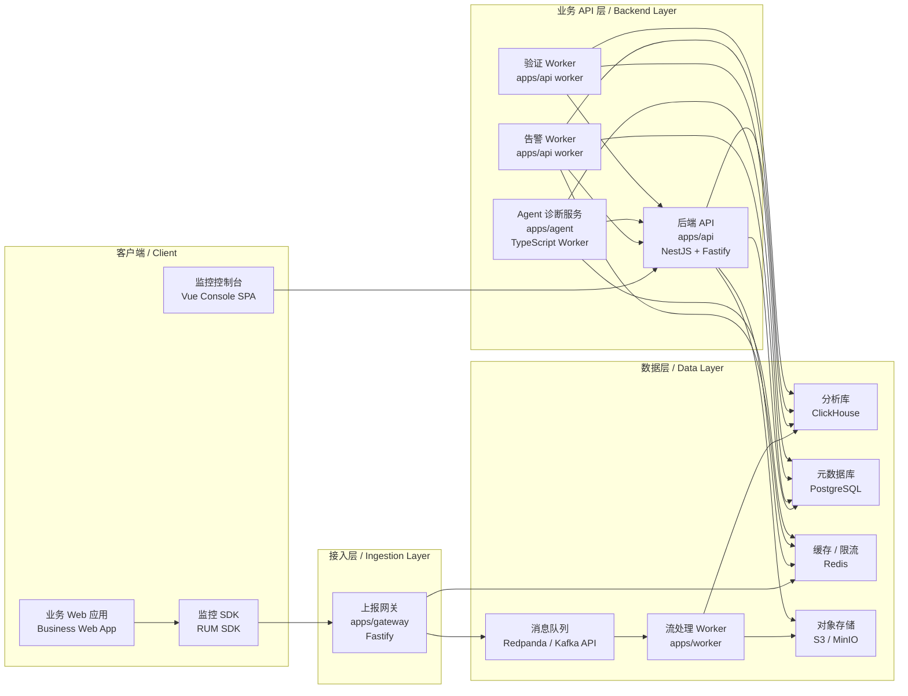

# AI Agent 前端性能监控平台：技术选型定稿

## 0. 选型结论

本项目采用 **TypeScript 单主栈 + 少量基础设施组件** 的技术路线。控制台前端采用 Vue 技术栈；SDK、API Backend、接入网关、流处理 Worker 和 Agent Service 默认均采用 TypeScript 实现。Agent Service 保持独立服务边界，允许在诊断复杂度提升后替换为 Python 实现，但不改变整体架构。

最终技术选型如下：

| 模块 | 技术选型 | 说明 |
| --- | --- | --- |
| Web SDK | TypeScript + Web Performance API + `web-vitals/attribution` | 自研轻量 RUM SDK |
| SDK 构建 | tsup / Rollup，输出 ESM + IIFE | 支持 npm 接入和 script 接入 |
| 控制台前端 | Vue 3 + TypeScript + Vite + Element Plus + ECharts | 内部监控工作台 |
| API Backend | NestJS + Fastify Adapter | 项目、权限、查询、告警、任务、报告和工作流 API |
| 接入网关 | Node.js + Fastify | SDK 上报入口，负责鉴权、限流、脱敏、采样和写入队列 |
| 流处理 Worker | Node.js Worker | 消费队列，清洗事件，归一化字段，批量写入 ClickHouse |
| Agent Service | TypeScript + NestJS Worker / Fastify | 独立诊断服务，受控工具调用，生成 Evidence Pack 和诊断报告 |
| 消息队列 | Redpanda，兼容 Kafka API | 上报事件削峰、缓冲和回放 |
| 分析存储 | ClickHouse | RUM 明细事件、聚合指标和多维分析 |
| 业务元数据 | PostgreSQL | 项目、权限、发布、告警、报告、任务和复盘 |
| 缓存与限流 | Redis | 采样配置、限流计数、热点缓存、任务状态 |
| 对象存储 | S3 / MinIO | sourcemap、原始归档、报告附件 |
| 部署 | Docker Compose + Kubernetes / Helm | 本地联调使用 Compose，生产使用 K8s |
| 仓库组织 | Monorepo | 一个仓库，多应用，多进程，多共享包 |

## 1. 选型原则

### 1.1 技术栈收敛

项目默认采用 TypeScript 单主栈，避免一开始引入过多语言和运行时。

```text
TypeScript:
  SDK / Console / API Backend / Ingestion Gateway / Stream Worker / Agent Service

基础设施:
  Redpanda / ClickHouse / PostgreSQL / Redis / S3 or MinIO
```

Go 和 Python 不作为默认技术栈。它们只在出现明确必要性时引入：

- Go：当接入网关或流处理 Worker 出现明确吞吐、CPU、内存或稳定性瓶颈时，再替换对应服务。
- Python：当 Agent 诊断需要复杂评测、实验、模型编排或 Python 生态能力时，再替换 Agent Service。

### 1.2 服务边界清晰

统一技术栈不代表单体进程。项目采用一个 monorepo 管理多个应用，每个核心服务独立启动、独立部署、独立扩缩容。

```text
同一个仓库
  -> 多个 apps
  -> 多个 packages
  -> 多个运行进程
```

### 1.3 主链路优先

所有技术选择服务于当前主链路：

```text
SDK 接入
  -> 数据上报
  -> 指标聚合与查询
  -> 异常告警
  -> Agent 只读取证诊断
  -> 人确认治理任务
  -> 修复发布后验证
  -> 复盘沉淀
```

### 1.4 Agent 可控

Agent 的定位是诊断服务，不是生产操作执行器。

Agent 必须满足：

- 只调用白名单工具。
- 只读取证据，不修改生产状态。
- 不直连 ClickHouse、PostgreSQL、Redis、S3。
- 所有工具调用有审计记录。
- 输出结构化 Evidence Pack 和诊断报告。
- 治理任务、修复验证、任务关闭等动作由平台工作流处理。

## 2. 服务架构

### 2.1 服务部署图



### 2.2 服务清单

| 服务 / 包 | 技术 | 部署方式 | 职责 |
| --- | --- | --- | --- |
| `apps/console` | Vue 3 + Vite + Element Plus + ECharts | 独立前端应用 | 监控总览、页面详情、告警详情、治理任务、接入设置 |
| `packages/sdk` | TypeScript + web-vitals | SDK 包 | Web RUM 数据采集与上报 |
| `apps/gateway` | Node.js + Fastify | 独立服务 | SDK 上报、鉴权、限流、脱敏、采样、写入队列 |
| `apps/worker` | Node.js Worker | 独立 Worker | 消费队列、事件清洗、字段归一化、批量写 ClickHouse |
| `apps/api` | NestJS + Fastify Adapter | 独立服务 | 项目、权限、查询、发布、告警、报告、任务、工作流 |
| `apps/api` Alert Worker | NestJS Worker | 独立进程 | 告警计算、告警收敛、通知发送 |
| `apps/api` Verification Worker | NestJS Worker | 独立进程 | 修复观察窗口、指标对比、验证结果写入 |
| `apps/agent` | TypeScript Worker / Fastify | 独立服务 | Agent 诊断任务、取证工具调用、Evidence Pack、报告生成 |
| `packages/schema` | Zod / JSON Schema / OpenAPI | 共享包 | 事件协议、工具契约、报告结构、跨服务类型 |

### 2.3 同步与异步边界

| 场景 | 调用方式 | 说明 |
| --- | --- | --- |
| SDK 上报 | SDK -> Gateway，同步 HTTP | Gateway 快速返回，不阻塞业务页面 |
| 事件入队 | Gateway -> Redpanda，异步 | 上报削峰和回放 |
| 事件入库 | Redpanda -> Worker -> ClickHouse，异步 | 清洗、归一化、批量写入 |
| 控制台查询 | Console -> API，同步 HTTP | API 做权限、脱敏和查询成本控制 |
| 告警计算 | Alert Worker -> ClickHouse / PostgreSQL，异步周期任务 | 告警写入 PostgreSQL |
| Agent 诊断 | API -> Agent Task，异步 | 页面轮询或订阅诊断任务状态 |
| Agent 取证 | Agent -> API Internal Tools，同步 HTTP | Agent 不直连数据库 |
| 修复验证 | Verification Worker -> API / ClickHouse，异步 | 按观察窗口输出验证结果 |

## 3. Monorepo 组织

### 3.1 目录结构

```text
apps/
  console/
  api/
  gateway/
  worker/
  agent/

packages/
  sdk/
  schema/
  config/
  ui/

infra/
  docker-compose/
  helm/
  migrations/

docs/
```

### 3.2 包职责

| 目录 | 职责 |
| --- | --- |
| `apps/console` | Vue 控制台 |
| `apps/api` | 主后端 API、告警 Worker、验证 Worker |
| `apps/gateway` | SDK 数据上报入口 |
| `apps/worker` | 队列消费和事件入库 |
| `apps/agent` | Agent 诊断服务 |
| `packages/sdk` | Web 监控 SDK |
| `packages/schema` | 共享 Zod Schema、JSON Schema、OpenAPI 契约 |
| `packages/config` | ESLint、TypeScript、Prettier、构建配置 |
| `packages/ui` | 控制台通用 UI 封装，基于 Vue 和 Element Plus |
| `infra` | 本地和生产部署配置 |
| `docs` | 产品、架构和接口文档 |

### 3.3 包管理与构建

| 项 | 选型 |
| --- | --- |
| 包管理 | pnpm workspace |
| 构建编排 | Turborepo 或 pnpm scripts |
| TypeScript 配置 | `packages/config` 统一管理 |
| Schema 管理 | `packages/schema` 统一维护 |
| API 契约 | OpenAPI |
| 运行配置 | `.env` + typed config |

## 4. 控制台前端选型

### 4.1 技术栈

| 项 | 选型 |
| --- | --- |
| 框架 | Vue 3 |
| 语言 | TypeScript |
| 构建 | Vite |
| UI 组件 | Element Plus |
| 图表 | Apache ECharts |
| 路由 | Vue Router |
| 状态管理 | Pinia |
| 请求状态 | TanStack Query for Vue 或 VueUse + 自封装 request hooks |

### 4.2 选择理由

- 控制台是内部工作台，表格、筛选、表单、弹窗和详情页较多，Element Plus 能快速覆盖基础交互。
- Vue 3 + TypeScript + Vite 适合构建中后台 SPA，开发效率高。
- ECharts 适合趋势图、分布图、指标卡、资源瀑布图和版本对比图。
- Pinia 适合管理项目、环境、全局筛选条件和用户信息。
- 控制台不需要 SSR、SEO 或服务端渲染，因此不采用 Next.js / Nuxt 作为默认框架。

### 4.3 前端边界

控制台只负责展示、筛选、交互和用户操作触发，不承接业务规则判断。

控制台不得：

- 直连 ClickHouse、PostgreSQL、Redis。
- 在前端拼接分析 SQL。
- 绕过 API Backend 调用 Agent。
- 在前端判断告警是否恢复或任务是否验收通过。

控制台必须：

- 所有数据查询通过 API Backend。
- 所有操作经过权限校验。
- 所有筛选条件使用统一 schema。
- Agent 报告中的证据 ID 可点击追溯到查询条件和样本。

## 5. API Backend 选型

### 5.1 技术栈

| 项 | 选型 |
| --- | --- |
| 框架 | NestJS |
| HTTP 适配器 | Fastify Adapter |
| 语言 | TypeScript |
| ORM / Query | Prisma 或 Kysely |
| 元数据库 | PostgreSQL |
| 分析库访问 | ClickHouse Client |
| API 风格 | REST |
| 长任务状态 | 轮询 / SSE |

### 5.2 职责

API Backend 是平台唯一业务 API 边界，负责：

- 项目、成员、权限、token、环境管理。
- 查询模板和 ClickHouse 查询封装。
- 发布数据、manifest、sourcemap 状态管理。
- 告警规则、告警详情、告警状态管理。
- Agent 工具接口。
- 诊断报告、Evidence Pack、工具审计日志管理。
- 治理任务、修复验证、复盘记录。

### 5.3 工程约束

- API Backend 不承接 SDK 高频上报。
- API Backend 不直接执行 Agent 诊断长任务。
- 对 ClickHouse 的查询必须通过 query template。
- 所有内部工具接口必须鉴权、限流、脱敏、审计。
- 对外 API 和内部工具 API 分路由、分权限、分审计。

## 6. 接入网关与流处理

### 6.1 接入网关 `apps/gateway`

技术栈：Node.js + Fastify。

职责：

- 接收 SDK 上报。
- 校验 project token、签名、CORS 白名单。
- 执行限流、字段大小限制、事件类型白名单。
- 执行 URL、Header、错误信息脱敏。
- 执行采样策略。
- 写入 Redpanda。
- 记录接入诊断日志。

网关不得：

- 写 PostgreSQL 业务表。
- 查询 ClickHouse。
- 执行业务告警逻辑。
- 调用 Agent。

### 6.2 流处理 Worker `apps/worker`

技术栈：Node.js Worker。

职责：

- 消费 Redpanda 事件。
- 做 UA 解析、地理信息补充、route/api/resource 归一化。
- 关联 release 信息。
- 批量写入 ClickHouse。
- 写入对象存储归档。
- 处理失败重试和死信队列。

Worker 必须支持：

- 批量消费。
- 批量写入。
- 背压控制。
- 幂等写入。
- 死信处理。
- 消费 lag 监控。

## 7. 数据存储选型

### 7.1 ClickHouse

ClickHouse 存储：

- RUM 明细事件。
- 1 分钟聚合指标。
- 1 小时聚合指标。
- 错误聚合。
- 资源聚合。
- API 聚合。

ClickHouse 只用于分析查询，不存储任务、权限、项目配置等事务型数据。

### 7.2 PostgreSQL

PostgreSQL 存储：

- 项目、成员、权限。
- project token 和环境配置。
- 发布记录、资源 manifest、sourcemap 状态。
- 告警规则和告警事件。
- Agent 报告和 Evidence Pack 元数据。
- 治理任务、修复验证和复盘记录。

### 7.3 Redis

Redis 用于：

- 采样配置缓存。
- token 和项目配置缓存。
- 网关限流计数。
- 告警收敛状态。
- Agent 任务短期状态。
- 热点查询缓存。

### 7.4 S3 / MinIO

对象存储用于：

- sourcemap 文件。
- 原始事件归档。
- Agent 报告附件。
- 导出文件。

## 8. Agent Service 选型

### 8.1 默认实现

Agent Service 默认使用 TypeScript 实现，作为独立服务或独立 Worker 运行。

| 项 | 选型 |
| --- | --- |
| 语言 | TypeScript |
| 运行形态 | 独立 Worker / Fastify Service |
| 模型调用 | OpenAI API / Responses API |
| 工具契约 | OpenAPI / JSON Schema |
| 结构校验 | Zod |
| 状态存储 | PostgreSQL + Redis |

### 8.2 Agent 边界

Agent 只通过 API Backend 的只读工具接口取证：

```text
Agent Service
  -> POST /internal/tools/query_metrics
  -> POST /internal/tools/query_events
  -> POST /internal/tools/analyze_resource
  -> POST /internal/tools/analyze_api
  -> POST /internal/tools/get_release_diff
```

Agent 不得：

- 直连 ClickHouse。
- 直连 PostgreSQL 业务表。
- 直连 Redis 查询业务状态。
- 直接创建任务。
- 关闭告警。
- 修改告警规则。
- 修改发布配置。

Agent 负责：

- 诊断任务状态机。
- 工具调用计划。
- Evidence Pack 构建。
- 根因候选推理。
- 诊断报告生成。
- 建议动作和任务草稿内容生成。

### 8.3 Python 替换原则

Agent 可以替换为 Python 服务，但只替换 `apps/agent`，不改变系统架构。

替换后：

```text
apps/agent
  Python + FastAPI / Worker
  -> 调用 API Backend internal tools
  -> 生成 Evidence Pack
  -> 生成诊断报告
  -> 写回 API Backend
```

Python Agent 必须继续遵守：

- 只通过 API Backend 工具取证。
- 不直连数据库。
- 不执行生产变更动作。
- 输入输出遵守 OpenAPI / JSON Schema。
- 工具调用和模型输出可审计。

## 9. 消息队列与异步任务

### 9.1 Redpanda

Redpanda 用作 Kafka API 兼容消息队列，承接 SDK 上报事件。

职责：

- 上报事件削峰。
- 写入失败缓冲。
- 事件回放。
- 流处理 Worker 消费。

### 9.2 后台任务

后台任务分为三类：

| 任务 | 运行位置 | 说明 |
| --- | --- | --- |
| 事件处理 | `apps/worker` | 消费上报事件并写入 ClickHouse |
| 告警计算 | `apps/api` worker | 周期读取聚合指标并生成告警 |
| 修复验证 | `apps/api` worker | 按观察窗口对比修复前后指标 |
| Agent 诊断 | `apps/agent` | 执行诊断任务并生成报告 |

## 10. 部署方案

### 10.1 本地环境

本地使用 Docker Compose 启动基础设施：

```text
PostgreSQL
Redis
ClickHouse
Redpanda
MinIO
```

应用服务本地直接启动：

```text
pnpm dev:console
pnpm dev:api
pnpm dev:gateway
pnpm dev:worker
pnpm dev:agent
```

### 10.2 生产环境

生产使用 Kubernetes + Helm。

部署单元：

```text
console
api
api-alert-worker
api-verification-worker
gateway
worker
agent
```

基础设施优先使用公司已有服务或托管服务：

```text
PostgreSQL
Redis
ClickHouse
Kafka / Redpanda
S3
```

## 11. 非默认技术栈引入规则

### 11.1 Go 引入规则

Go 只用于替换接入网关或流处理 Worker。

满足以下条件之一时允许引入：

- Node.js Gateway 在压测中无法满足目标上报 QPS。
- Worker 出现持续 CPU 或内存瓶颈。
- 背压和批量写入在 Node.js 中难以稳定控制。
- 生产稳定性要求超过当前 Node.js 实现能力。

Go 引入后不得改变协议边界：

```text
SDK -> Gateway -> Redpanda -> Worker -> ClickHouse
```

### 11.2 Python 引入规则

Python 只用于替换 Agent Service。

满足以下条件之一时允许引入：

- TypeScript Agent 无法满足复杂诊断编排。
- 需要引入 Python 生态的评测、实验或模型编排工具。
- 需要更成熟的 Pydantic / Agent framework 能力。

Python 引入后不得改变 Agent 边界：

```text
Agent -> API Backend internal tools -> Evidence Pack -> Diagnosis Report
```

## 12. 最终决策摘要

| 决策项 | 结论 |
| --- | --- |
| 是否使用 monorepo | 是 |
| 是否统一 TypeScript 主栈 | 是 |
| 控制台前端 | Vue 3 + TypeScript + Vite |
| 后端 API | NestJS + Fastify Adapter |
| 是否使用 Next.js / Nuxt 全栈 | 否 |
| SDK 上报是否进 API Backend | 否，进入独立 Gateway |
| Agent 是否独立 | 是 |
| Agent 默认语言 | TypeScript |
| Agent 是否可替换 Python | 可以，只替换 `apps/agent` |
| Gateway / Worker 默认语言 | TypeScript |
| Gateway / Worker 是否可替换 Go | 可以，出现明确瓶颈后替换 |
| 分析存储 | ClickHouse |
| 事务元数据 | PostgreSQL |
| 缓存与限流 | Redis |
| 消息队列 | Redpanda / Kafka API |
| 对象存储 | S3 / MinIO |

